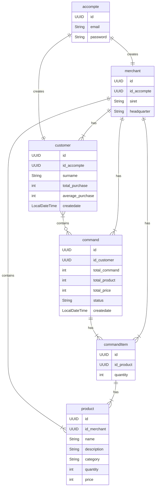
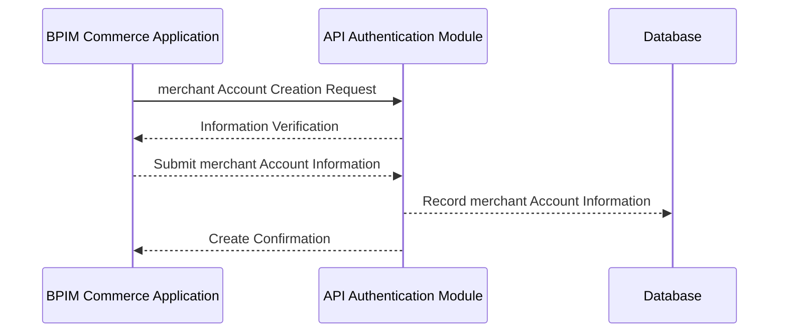
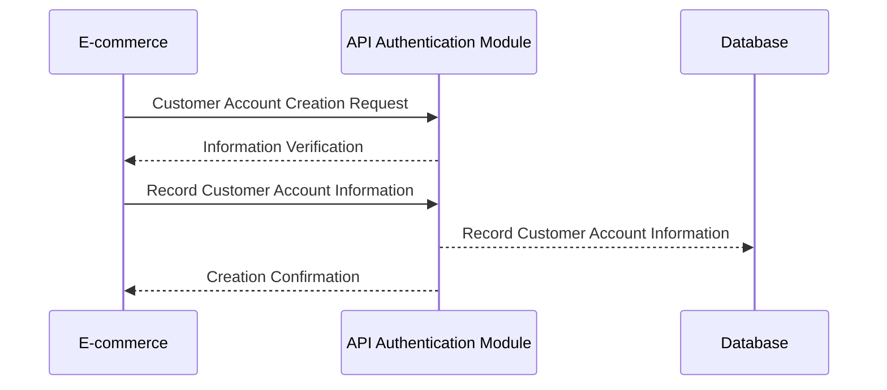
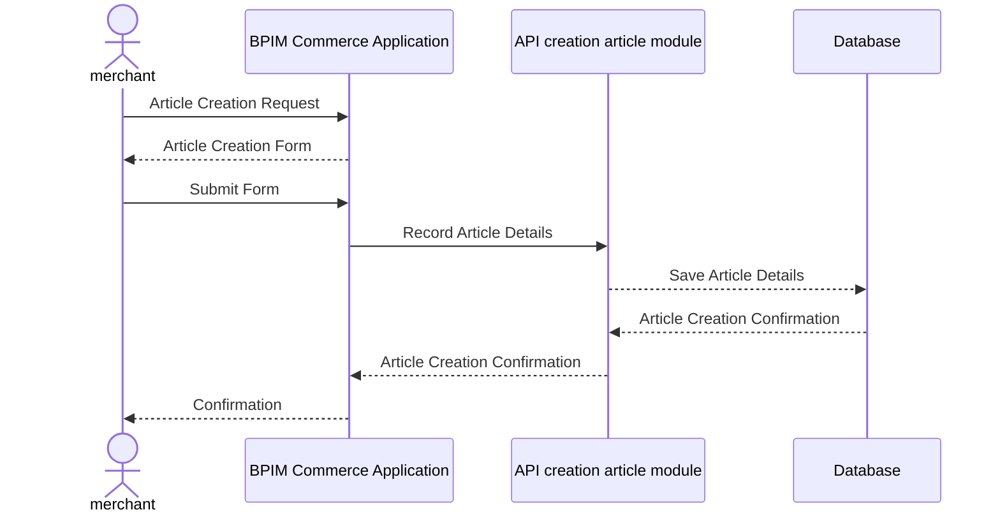
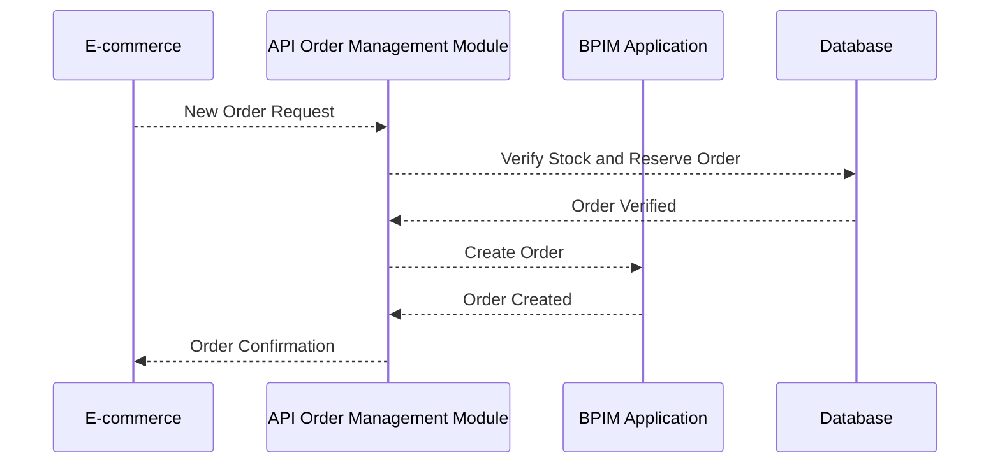
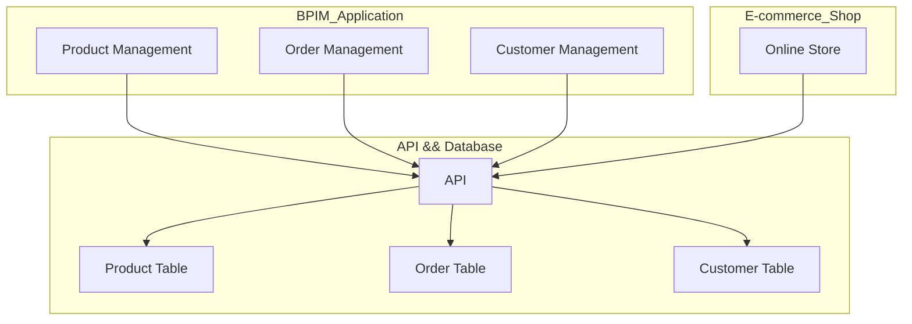

# BPIM Management Commerce  Application 

## Introduction 

Welcome to the BPIM Application repository! 

   This project is a comprehensive Business and Product Information Management service designed to empower merchants in effectively managing their commercial activities.
    The application incorporates a robust Product Information Management (PIM) system:
    
    Offering features such as real-time inventory monitoring sales tracking:
    - product data management
    - customer data management
    - ...

## How It Works

**Key Features**

Preview of wirframe: [wireframe]

1. **Product Management**
   Merchants can use the application to add, modify, and delete products from their inventory. Each product can have details such as images, descriptions, prices, and categories.

2. **Order Management**
   Customer orders are handled through the application. Merchants can create new orders, update order statuses in real-time, and track order history.

3. **Customer Management**
   Customer information, including contact details, preferences, and purchase history, is stored in the application. This enables better interaction with customers and provides a more personalized service.

4. **Statistics and Reports**
   The application generates reports and statistics on sales, inventory trends, and product performance, aiding merchants in making informed decisions.

5. **BIM and PIM Integration**
   The application integrates a BIM and PIM system that collects and manages essential business information, such as financial data, stocks, and product performance. BIM with PIM provides merchants with a comprehensive view of their business.

**Interaction with E-commerce**
Preview of e-commerce connected to the BPIM application: [Link to Figma Prototype](https://www.figma.com/proto/4vzJOvKAsIQKHzrgyiDYe0/Untitled?type=design&node-id=4-2&t=6Yqm35NHOlusvSU2-0&scaling=scale-down&page-id=0%3A1&starting-point-node-id=4%3A2)

The BPIM application interacts with e-commerce in the following ways:

- **Real-time Updates**
  E-commerce is connected to the BPIM application for real-time updates on product information, prices, and stock. This ensures online customers see accurate information on products and orders.

- **E-commerce Order Management**
  When a final customer places an online order, the BPIM application receives and manages the order within the system. Merchants can track these orders through the application.

- **Synchronized Inventory**
  The PIM integrated with BIM ensures inventory synchronization between sales, facilitating better stock management to avoid shortages.

- **Reports and Analysis:**
  E-commerce data is integrated into the reports and analyses of the BPIM application, providing a comprehensive view of business performance.

### Conclusion:

The BPIM Commerce Management application is a powerful tool for merchants seeking effective business management. The integration of BIM ensures data management and an enhanced customer experience, while PIM allows for the effective management of each product for business optimization. Future developments may include logistics management (delivery), supplier management (agreements, meetings), detailed promotions, HR, etc.

---

## Representation of entities in a diagram.

The diagram is created using the [Entity Relationship Diagrams de mermaid](https://mermaid.js.org/syntax/entityRelationshipDiagram.html)

| Value (left) | Value (right) | Meaning                      |
|--------------|---------------|------------------------------|
| \|o          | o\|           | Zero or one                  |
| \| \|        | \| \|         | Exactly one                  |
| }o           | o\{           | Zero or more (no upper limit)|
| }\|          | \|\{          | One or more (no upper limit) |

---

## Business rule

### Account Creation

*Sequence Diagram (merchant Account Creation):*

*Rule Details (merchant Account Creation):*

1. **merchant Account Creation Request:**
   - A merchant wants to create an account and requests it through the BPIM Commerce application.

2. **Information Verification:**
   - The API Authentication Module verifies the provided information to ensure its validity.

3. **Recording merchant Account Information:**
   - Once the information is validated, the BPIM Commerce application records the details of the merchant account.

4. **Creation Confirmation:**
   - The API Authentication Module confirms the creation of the merchant account, and the BPIM Commerce application informs the merchant of the successful account creation.

---

*Sequence Diagram (Customer Account Creation):*

*Rule Details (Customer Account Creation):*
1. **Customer Account Creation Request:**
   - A customer wants to create an account and requests it through the e-commerce platform.

2. **Information Verification:**
   - The Authentication Module verifies the provided information to ensure its validity.

3. **Recording Customer Account Information:**
   - Once the information is validated, the e-commerce platform records the details of the customer account.

4. **Creation Confirmation:**
   -  The API Authentication Module confirms the creation of the customer account, and the e-commerce platform informs the customer of the successful account creation.
---
### Article Creation in the Application

- The BPIM Commerce application allows merchants to create articles to enrich their inventory. This business rule defines the article creation process, from the merchant to storage in the database.

*Sequence Diagram (Article Creation) :*

*Rule Details (Article Creation) :*
1. **Article Creation Request :**
   - The mercant initiates the process by requesting the creation of a new article through the BPIM Commerce application.

2. **Article Creation Form :**
   - The BPIM Commerce application generates a form allowing the mercant to provide article details such as name, description, price, and quantity.

3. **Form Submission:**
   - The merchant fills out the form and submits it to the BPIM Commerce application.

4. **Record Article Details:**
   - The BPIM Commerce application records article details, including name, description, price, and quantity, in the database by API.

5. **Article Creation Confirmation:**
   - The database confirms the successful creation of the article to the API.The API confirm to the BPIM Commerce application sends a confirmation to the merchant.

*Note :*
- This rule ensures a smooth process for creating articles, allowing merchants to add new products to their inventory efficiently.
---
### Processing Customer Orders 

*Description:*
- When a customer places an order in the e-commerce platform, the system initiates the order and processing workflow.

*Sequence Diagram: (Customer Orders)*

*Rule Details:*
1. **Trigger:**
   - A customer places a new order through the connected e-commerce platform.

2. **Order Creation:**
   - The BPIM application receives the new order request.
   - The Order Management Module creates a new order in the system.
   - The system generates a unique order ID and records order details such as total price, product quantities, and status.

3. **Confirmation:**
   - The BPIM application sends an order confirmation to the e-commerce platform, confirming successful order creation.
   - The e-commerce platform informs the customer about the order confirmation.

*Note:*
- This rule ensures a seamless flow of order processing between the e-commerce platform and the BPIM application. It guarantees that each order is accurately recorded in the system, enabling merchants to track and manage orders efficiently.

---

*Rules flow between BPIM and E_commerce by API in Database:*

In this graph:

- The "BPIM Application" section includes modules for Product Management, Order Management, and Customer Management.
- The "E-commerce Shop" section represents the online store.
- The " Database" section is the common database containing tables for products, orders, and customers.

The arrows indicate the relationships and interactions between different components. For example, modules in the BPIM Application interact with the API database, and the Online Store interacts with the  API database too for real-time updates, order management, and synchronized inventory.

---

# Conclusion

With this architecture, creating articles in the online store is possible. Here's how it works, based on the defined architecture:

1. The merchant uses the "Product Management" module of the BPIM application to create a new article. This can include details such as name, description, price, and stock quantity.

2. Once the new article is created in the "Product Management" module of BPIM, information about this article is stored in the  database's product table by API.

3. The online store (the "Online Store" module) is connected to API by the  database to get real-time updates on product information. Therefore, the newly created article by the merchant will automatically be available in the online store without requiring additional processes.

4. Customers visiting the online store can view and purchase the newly added article. Orders placed by customers are also recorded in the  database's order table.

In summary, the architecture allows centralized management of products through the BPIM application, and these products are immediately reflected in the online store through the connection by API with the  database. This provides an efficient and consistent solution for creating, managing, and making articles available in the online store.